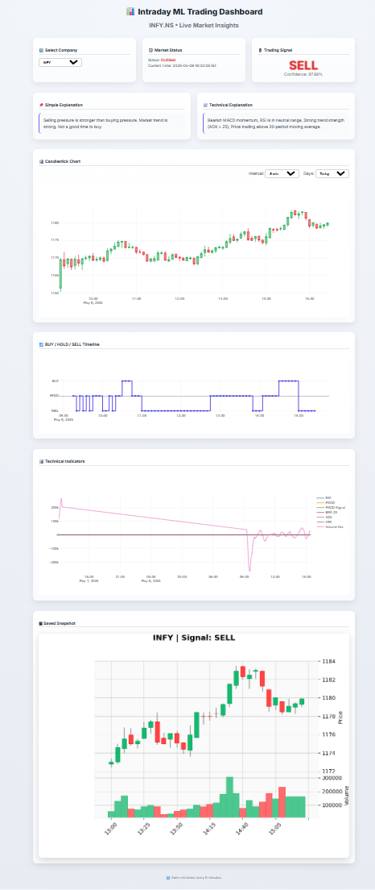
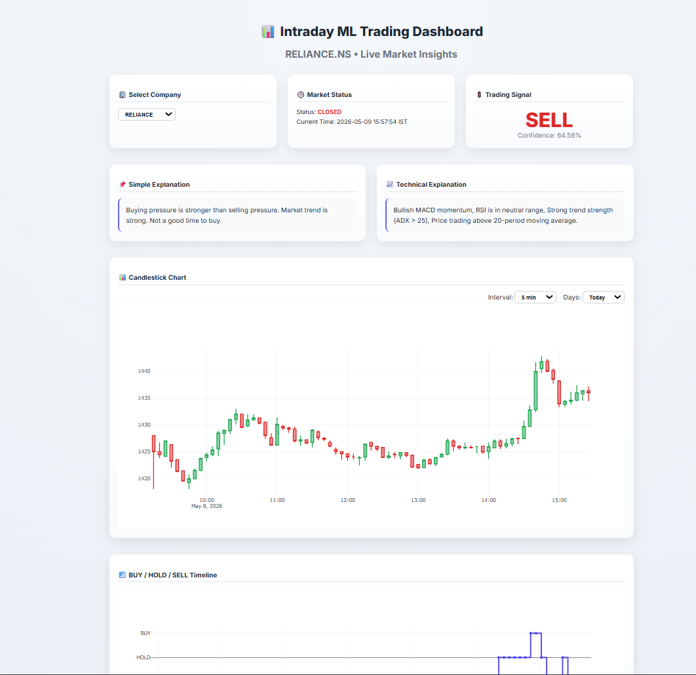
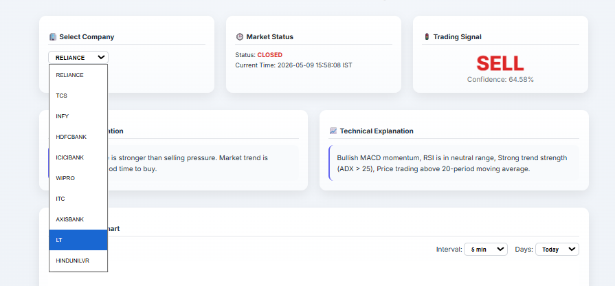
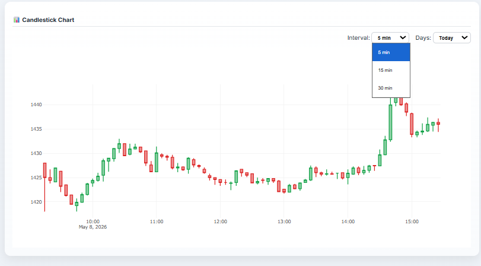
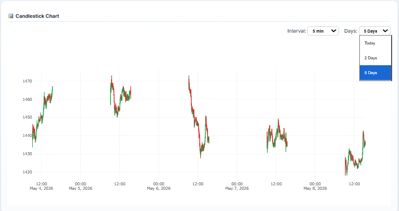
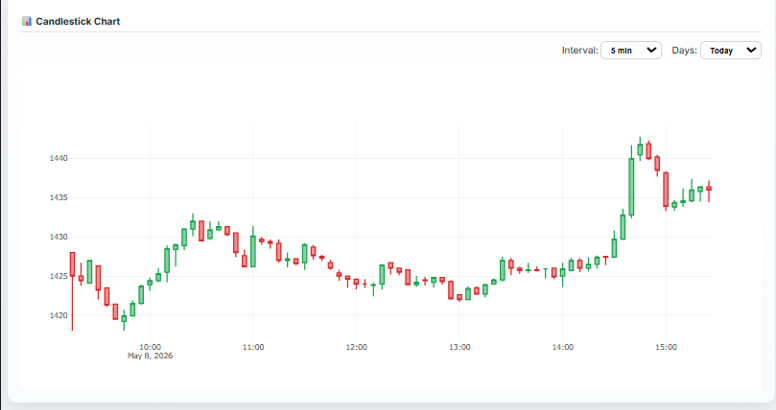
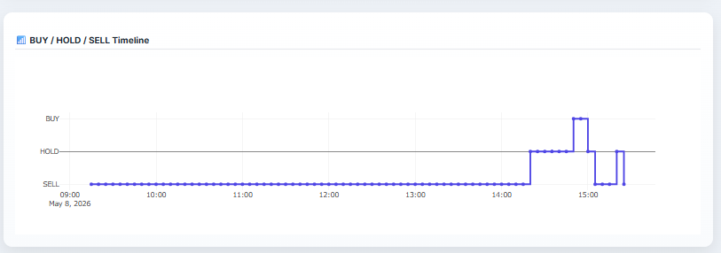
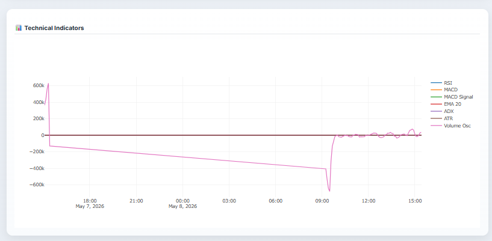
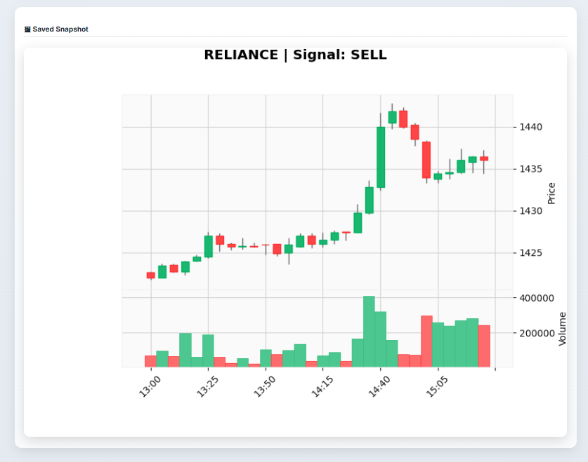

# Smart Intraday Stock Prediction System

A production-ready machine learning powered web application for real-time intraday stock signal prediction on major NSE-listed companies. The system combines live market data, technical indicator engineering, and trained classification models to generate actionable BUY, HOLD, and SELL signals with confidence scores and explainable insights.

---

## Overview

This project is an end-to-end algorithmic trading dashboard designed to:

* Fetch live intraday stock data from Yahoo Finance
* Engineer technical indicators in real time
* Load pre-trained machine learning models for each stock
* Predict BUY / HOLD / SELL signals
* Display model confidence scores
* Provide human-readable explanations
* Render interactive visualizations using Plotly
* Save candlestick chart snapshots automatically

The dashboard is built using Flask and designed with a professional responsive interface suitable for portfolio demonstrations, academic projects, and industry interviews.

---

## Live Dashboard Preview

### Full Dashboard

<p align="center">
  
</p>

### Sample Dashboard Output

<p align="center">
  
</p>

---

## Key Features

### Real-Time Data Pipeline

* Live intraday data from Yahoo Finance
* Supports 5-minute, 15-minute, and 30-minute intervals
* Multi-day visualization (Today, 2 Days, 5 Days)

### Machine Learning Predictions

* BUY / HOLD / SELL classification
* Probability-based confidence score
* Stock-specific trained models

### Explainable Insights

* Simple explanation for non-technical users
* Technical explanation using indicators such as RSI, MACD, and ADX

### Advanced Visualizations

* Interactive candlestick chart
* Signal timeline chart
* Technical indicators chart
* Saved candlestick snapshots

### Market Awareness

* NSE market open/closed detection
* Live IST clock
* Next candle countdown

### Auto Refresh

* Automatically refreshes every 10 seconds while preserving selected filters

---

## Supported Stocks

| Company                   | Symbol        | Model File      |
| ------------------------- | ------------- | --------------- |
| Reliance Industries       | RELIANCE.NS   | trend_model.pkl |
| Tata Consultancy Services | TCS.NS        | TCS.pkl         |
| Infosys                   | INFY.NS       | INFY.pkl        |
| HDFC Bank                 | HDFCBANK.NS   | HDFCBANK.pkl    |
| ICICI Bank                | ICICIBANK.NS  | ICICIBANK.pkl   |
| Wipro                     | WIPRO.NS      | WIPRO.pkl       |
| ITC                       | ITC.NS        | ITC.pkl         |
| Axis Bank                 | AXISBANK.NS   | AXISBANK.pkl    |
| Larsen & Toubro           | LT.NS         | LT.pkl          |
| Hindustan Unilever        | HINDUNILVR.NS | HINDUNILVR.pkl  |

---

## Dashboard Architecture

<p align="center">
  
</p>

The dashboard is composed of:

1. Company Selection
2. Market Status Panel
3. Trading Signal Card
4. Simple Explanation
5. Technical Explanation
6. Interactive Candlestick Chart
7. BUY / HOLD / SELL Timeline
8. Technical Indicators Chart
9. Saved Snapshot

---

## Machine Learning Pipeline

### Data Acquisition

Historical and live intraday data are downloaded using `yfinance`.

### Feature Engineering

Technical indicators are calculated using the `ta` library.

### Model Training

Each stock is trained independently using supervised classification models.

### Prediction

Latest features are passed to the corresponding model to predict:

* `0 → SELL`
* `1 → HOLD`
* `2 → BUY`

### Visualization

Results are displayed through Flask templates and Plotly charts.

---

## Technical Indicators Used

The models are trained using the following features:

| Feature     | Description                           |
| ----------- | ------------------------------------- |
| Close       | Closing price                         |
| hl_range    | High - Low                            |
| oc_change   | Close - Open                          |
| pct_change  | Percentage change                     |
| ma_5        | 5-period moving average               |
| ma_10       | 10-period moving average              |
| ma_20       | 20-period moving average              |
| RSI         | Relative Strength Index               |
| ADX         | Average Directional Index             |
| MACD        | Moving Average Convergence Divergence |
| MACD Signal | MACD signal line                      |
| MACD Diff   | MACD histogram                        |
| BB Width    | Bollinger Band width                  |

Additional indicators used for visualization:

* EMA 20
* ATR
* Volume Oscillator
* Bollinger Bands

---

## Machine Learning Algorithms Used

The project uses tree-based ensemble models, including:

* Random Forest Classifier
* XGBoost Classifier

The deployed model for each stock is saved as a `.pkl` file using Joblib.

---

## Model Performance Summary

> Replace the placeholder values below with the exact values from your training notebooks.

| Stock      | Algorithm               | Accuracy | Precision | Recall | F1-Score |
| ---------- | ----------------------- | -------: | --------: | -----: | -------: |
| RELIANCE   | Random Forest / XGBoost |   XX.XX% |    XX.XX% | XX.XX% |   XX.XX% |
| TCS        | Random Forest / XGBoost |   XX.XX% |    XX.XX% | XX.XX% |   XX.XX% |
| INFY       | Random Forest / XGBoost |   XX.XX% |    XX.XX% | XX.XX% |   XX.XX% |
| HDFCBANK   | Random Forest / XGBoost |   XX.XX% |    XX.XX% | XX.XX% |   XX.XX% |
| ICICIBANK  | Random Forest / XGBoost |   XX.XX% |    XX.XX% | XX.XX% |   XX.XX% |
| WIPRO      | Random Forest / XGBoost |   XX.XX% |    XX.XX% | XX.XX% |   XX.XX% |
| ITC        | Random Forest / XGBoost |   XX.XX% |    XX.XX% | XX.XX% |   XX.XX% |
| AXISBANK   | Random Forest / XGBoost |   XX.XX% |    XX.XX% | XX.XX% |   XX.XX% |
| LT         | Random Forest / XGBoost |   XX.XX% |    XX.XX% | XX.XX% |   XX.XX% |
| HINDUNILVR | Random Forest / XGBoost |   XX.XX% |    XX.XX% | XX.XX% |   XX.XX% |

---

## User Interface Components

### Company Selection

<p align="center">
  
</p>

Allows users to switch between supported stocks dynamically.

---

### Interval and Days Filters

<p align="center">
  
</p>

<p align="center">
  
</p>

#### Supported Intervals

* 5 Minutes
* 15 Minutes
* 30 Minutes

#### Supported Day Filters

* Today
* 2 Days
* 5 Days

---

### Candlestick Chart

<p align="center">
  
</p>

Interactive Plotly candlestick chart with zoom and pan support.

---

### BUY / HOLD / SELL Timeline

<p align="center">
  
</p>

Shows how model predictions evolve over time.

---

### Technical Indicators Chart

<p align="center">
  
</p>

Displays RSI, MACD, ADX, ATR, EMA, and Volume Oscillator.

---

### Saved Snapshot

<p align="center">
  
</p>

Automatically generated candlestick image using `mplfinance`.

---

## Project Structure

```text
StockPredictionApp/
│
├── app.py
├── a.py
├── features.pkl
├── live_predictions_log.csv
│
├── templates/
│   └── index.html
│
├── charts/
│   └── Generated PNG chart snapshots
│
├── output/
│   ├── Candlechart.png
│   ├── Company_selection.png
│   ├── Interval_days_selection.png
│   ├── Interval_min_selection.png
│   ├── overall_dashboard.png
│   ├── Sample_dashboard.png
│   ├── Saved_charts_pic.png
│   ├── Technical_indicatorschart.png
│   └── Timeline_chart.png
│
├── stock prediction collab files/
│   ├── reliance.ipynb
│   ├── tcs.ipynb
│   ├── infosys.ipynb
│   ├── AXISBANK.ipynb
│   ├── HDFCBANK.ipynb
│   ├── HINDUNILVR.ipynb
│   ├── ICICIBANK.ipynb
│   ├── ITC.ipynb
│   ├── LT.ipynb
│   └── WIPRO.ipynb
│
├── trend_model.pkl
├── TCS.pkl
├── INFY.pkl
├── HDFCBANK.pkl
├── ICICIBANK.pkl
├── WIPRO.pkl
├── ITC.pkl
├── AXISBANK.pkl
├── LT.pkl
└── HINDUNILVR.pkl
```

---

## Installation

### Clone Repository

```bash
git clone https://github.com/FFTOPPER/Smart-Intraday-Stock-Prediction-System-.git
cd Smart-Intraday-Stock-Prediction-System-
```

### Create Virtual Environment

#### Windows

```bash
python -m venv venv
venv\Scripts\activate
```

#### Linux/macOS

```bash
python3 -m venv venv
source venv/bin/activate
```

### Install Dependencies

```bash
pip install --upgrade pip
pip install flask yfinance pandas numpy joblib ta mplfinance matplotlib pytz scikit-learn xgboost plotly
```

---

## Running the Application

```bash
python app.py
```

Open in your browser:

```text
http://127.0.0.1:5000
```

---

## API Endpoints

| Endpoint             | Description                     |
| -------------------- | ------------------------------- |
| `/`                  | Main dashboard                  |
| `/live-data`         | OHLC data for candlestick chart |
| `/signal-data`       | BUY / HOLD / SELL timeline      |
| `/indicator-data`    | Technical indicators            |
| `/charts/<filename>` | Saved chart image               |

---

## Trading Signal Logic

| Predicted Class | Signal |
| --------------: | ------ |
|               0 | SELL   |
|               1 | HOLD   |
|               2 | BUY    |

---

## Market Timing Logic

The application automatically detects NSE trading hours.

| Session      | Time (IST) |
| ------------ | ---------- |
| Market Open  | 09:15 AM   |
| Market Close | 03:30 PM   |
| Weekends     | Closed     |

---

## Confidence Calculation

```python
proba = model.predict_proba(X)
confidence = max(proba[0]) * 100
```

The confidence score indicates how strongly the model supports the predicted signal.

---

## Example Prediction Output

```json
{
  "Company": "RELIANCE",
  "Signal": "SELL",
  "Confidence": "64.58%",
  "Price": 1435.60,
  "Simple Reason": "Selling pressure is stronger than buying pressure.",
  "Technical Reason": "Bearish MACD momentum, RSI neutral, strong trend."
}
```

---

## Performance Considerations

* Fast inference using pre-trained models
* Real-time data refresh every 10 seconds
* Dynamic filtering without losing selections
* Automatic chart snapshot generation

---

## Future Enhancements

* Backtesting engine
* Portfolio simulation
* Telegram and email alerts
* Risk management module
* Multi-timeframe confirmation
* Cloud deployment
* Docker support

---

## Technology Stack

| Layer                | Technologies                  |
| -------------------- | ----------------------------- |
| Backend              | Flask, Python                 |
| Data Source          | Yahoo Finance (`yfinance`)    |
| Machine Learning     | Scikit-learn, XGBoost         |
| Technical Indicators | `ta`                          |
| Visualization        | Plotly, mplfinance            |
| Frontend             | HTML, CSS, JavaScript, Jinja2 |

---

## Author

**B. Adheje**

Data Science and Machine Learning Enthusiast

LinkedIn: https://www.linkedin.com/in/adhejeb

---

## License

This project is licensed under the MIT License.

---

## Disclaimer

This project is developed for educational and research purposes only. It should not be considered financial advice. Always conduct independent analysis before making investment decisions.
